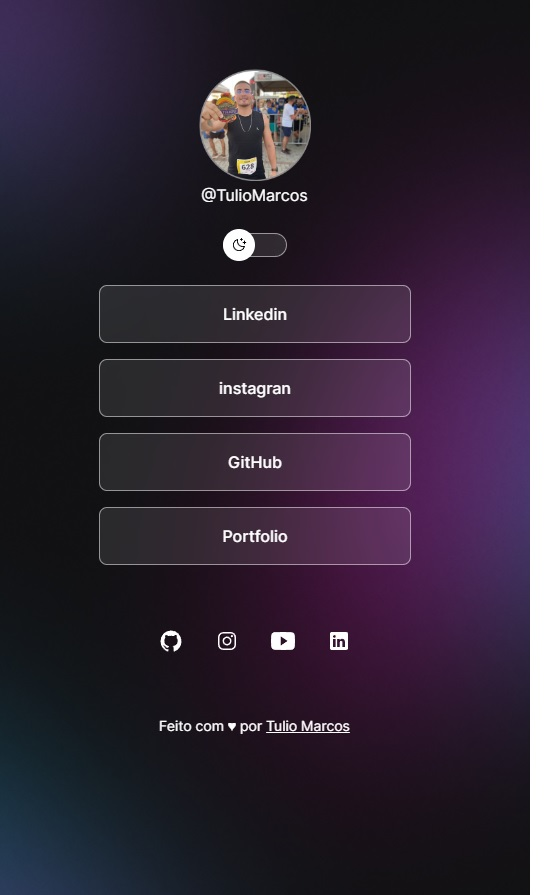

<h1 align="center"> Dev Links </h1>

Programa exclusivo e gratuito, promovido pela Rocketseat para ensio de tecnologias WEB.  

  <a href="#-tecnologias">Tecnologias</a>&nbsp;&nbsp;&nbsp;|&nbsp;&nbsp;&nbsp;
  <a href="#-projeto">Projeto</a>&nbsp;&nbsp;&nbsp;|&nbsp;&nbsp;&nbsp;
  <a href="#-layout">Layout</a>&nbsp;&nbsp;&nbsp;|&nbsp;&nbsp;&nbsp;
  <a href="#memo-licença">Licença</a>

  

 

  

## 🚀 Tecnologias

Esse projeto foi desenvolvido com as seguintes tecnologias:

- HTML e CSS
- JavaScript
- Git e Github
- Figma

## 💻 Projeto

O DevLinks é um Projeto para Divulgar seus Projetos.

## 🔖 Layout

Você pode visualizar o layout do projeto através [DESSE LINK](https://efficient-sloth-d85.notion.site/DevLinks-d7841615addc4269ba5c5bba12a6edbe). É necessário ter conta no [Figma](https://figma.com) para acessá-lo.

##  Licença

Esse projeto está sob a licença MIT.

---

